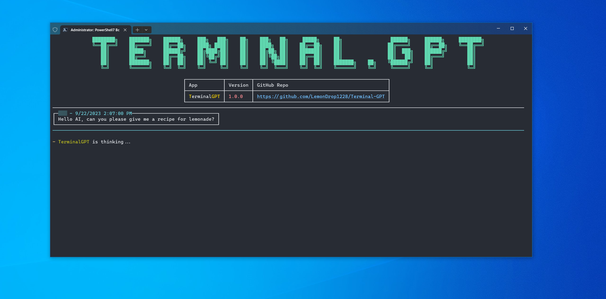
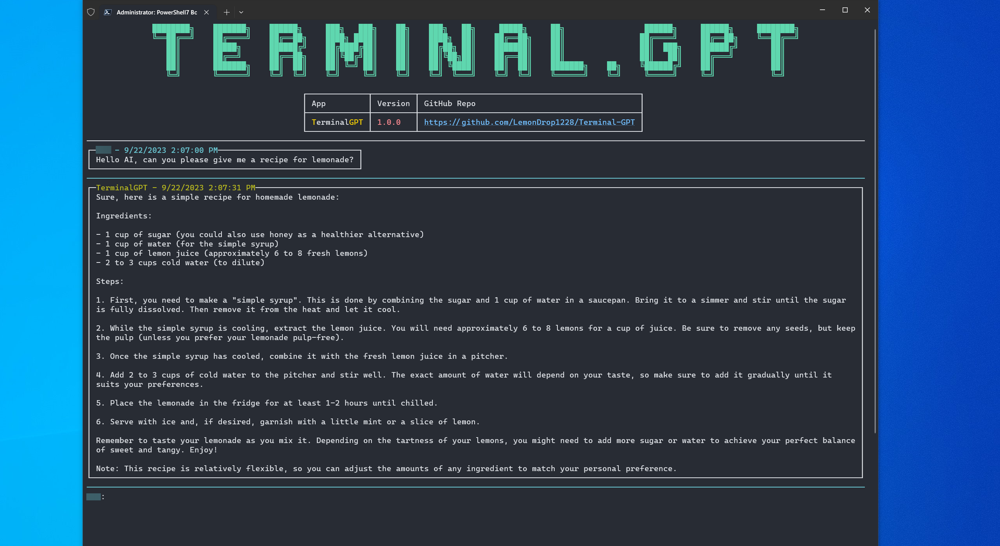

# Terminal.GPT 
### OpenAI ChatGPT Terminal Client

This project is an interactive, terminal-based chat client for OpenAI's ChatGPT, built on the robust .NET 6.0 platform. It leverages the power of the OpenAI API to deliver a responsive and engaging AI chat experience right in your terminal.

## Features

- **Terminal-based Interaction**: Engage with the ChatGPT model directly from your terminal.
- **OpenAI Integration**: Uses the official OpenAI-DotNet client library for seamless interaction with the ChatGPT model.
- **Customizable Settings**: Configuration settings can be easily adjusted in the `appsettings.json` file.
- **Enhanced input**: Input is enhanced with a custom input system that allows for the use of arrow keys, backspace, and more. (PageDown is used for newlines.)
- **Simple Installation**: Installation is automated via a PowerShell script that downloads the latest release and sets up the application for you.
- **More**: More features are planned for the future. See the 'Roadmap' section for more details.


## Acknowledgments

<details open>
<summary>Click to expand!</summary>
  <p>
  - [OpenAI](https://github.com/openai) for their incredible GPT-3 model and API.
  - The .NET community for providing a powerful platform and useful libraries.
  - [Newtonsoft.Json](https://github.com/JamesNK/Newtonsoft.Json) for its high-performance JSON framework.
  - [ OpenAI-API-dotnet](https://github.com/OkGoDoIt/OpenAI-API-dotnet) for the official .NET client library for the OpenAI API.
  - [Spectre.Console](https://github.com/spectreconsole/spectre.console) for enabling the creation of beautiful console applications.
  </p>
</details>

## Installation

The installation process for `Terminal.GPT` is automated via a `PowerShell script` that sits at the root of the repository. Here is the step-by-step process:

1. Open `PowerShell` as an **Administrator**.⚠️IMPORTANT⚠️

2. Run the following command to allow the execution of scripts:

```powershell
Set-ExecutionPolicy Bypass -Scope Process -Force;
```
 > this is required to enable remote script execution

3. Download and run the installation script using the following command:

```powershell
Invoke-Expression (Invoke-WebRequest -Uri https://raw.githubusercontent.com/LemonDrop1228/Terminal.GPT/main/EasyInstall_Script.ps1 -UseBasicParsing).Content
```
 > this downloads the latest easy install script bypassing cached versions, and executes the interactive installation session


 > This script will download the latest release of Terminal.GPT, unzip the archive, move the unzipped contents to your `LOCALAPPDATA` directory, and create a shortcut on your Desktop. If an error is encountered during any of these steps, the script will clean up any files it created before the error occurred.

4. At the end of the installation, you'll be provided with a command you can copy and run in your PowerShell session to add Terminal.GPT to your `PATH` environment variable. This step is recommended as it allows you to run TerminalGPT from any location:

```powershell
[Environment]::SetEnvironmentVariable("PATH",`$ENV:Path+";{appPath}", [System.EnvironmentVariableTarget]::User)
```
#### _Notes_

> Once these steps are complete, you can launch Terminal.GPT from any PowerShell or Command Prompt session by typing `TerminalGPT`.

> For more details on how to interact with the Terminal.GPT, please see the 'Usage' section.


## Roadmap

- [x] Basic terminal interface
- [x] OpenAI API integration
- [x] Basic chat functionality
- [x] Command system
  - [x] Save command - saves the current conversation to a file
  - [x] Exit command - exits the application 
  - [ ] Help command - displays a list of available commands
  - [ ] Load command - loads a conversation from a file
  - [ ] Settings command - displays a list of available settings
  - [ ] Set command - sets a specified setting to a specified value
  - [ ] Menu command - displays a list of available menus
  - [ ] SetThread command - sets the current thread to a specified thread
  - [ ] ListThreads command - displays a list of available threads
  - [ ] CreateThread command - creates a new thread
  - [ ] DeleteThread command - deletes a specified thread
  - [ ] RenameThread command - renames a specified thread
  - [ ] SaveAs command - saves the current conversation to a specified file using a file dialog
  - [ ] LoadLast command - loads the last conversation from a file
  - [ ] About command - displays information about the application
  - [ ] Macros command - displays a list of available macros
  - [ ] Macro command - executes a specified macro
- [x] Customizable settings
- [x] Customizable system prompts
- [ ] Customizable temperature
- [ ] Streaming output
- [ ] Custom themes
- [ ] Fluent menu system
- [ ] Customizable menus
- [ ] Customizable macros
- [ ] Shell integration (Windows)
- [ ] Shell integration (Linux)
- [ ] Shell integration (macOS)
- [ ] OS-specific installation scripts
- [ ] Scoop/Chocolatey package/bucket
- [ ] OS automation - interact with your OS via Terminal.GPT and operate your computer with natural language


## Previews
<details>
<summary>Click to expand!</summary>

Here are some previews of the terminal client in action:





</details>

## Getting Started

### Prerequisites

- An OpenAI API key: Required to interact with the ChatGPT model.
- An OpenAI Organization: Required to create an OpenAI account and obtain an API key.
- .NET 6.0 SDK: Required to build and run the application.

### Source Code

1. Clone the repository to your local machine.
2. Open the solution in your preferred .NET-compatible IDE (like JetBrains Rider or Visual Studio).
3. Restore the NuGet packages (this should happen automatically in most IDEs).
4. Enter your OpenAI API key in the `appsettings.json` file.
5. Build and run the solution.

## Usage

Upon launching the application, you'll be presented with a terminal interface. Simply type your input and press enter to send it to the ChatGPT model. The model's response will be displayed in the terminal.

## Contributing

We welcome contributions from the community. To contribute:

1. Fork the repository.
2. Create a new branch for your changes.
3. Commit your changes to your branch.
4. Create a pull request detailing your changes.

## License

This project is licensed under the GNU General Public License v3.0. This license allows you the freedom to use, modify, and distribute the software, but you must ensure the same freedoms for others when distributing your versions. See the `LICENSE` file for more details.


## Donation

If you find this project helpful and would like to support its development, you can make a donation via PayPal. Your contribution will help us continue improving and maintaining this project.

[PayPal](https://www.paypal.com/donate/?business=J8UBHVFCN2EEN&no_recurring=0&currency_code=USD)
