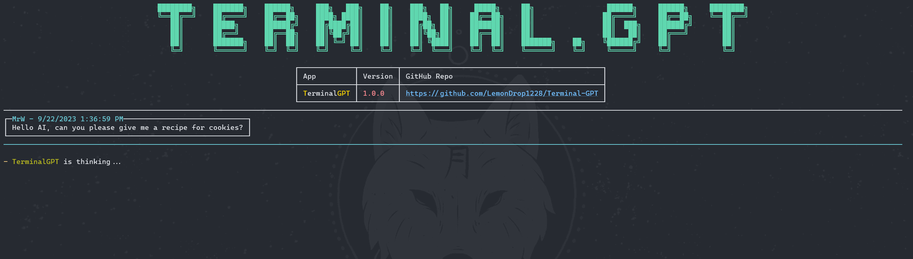
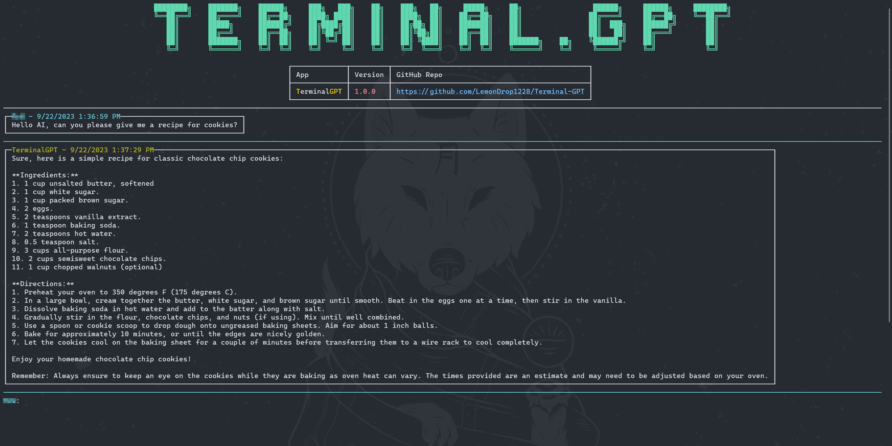

# Terminal.GPT 
### OpenAI ChatGPT Terminal Client

This project is an interactive, terminal-based chat client for OpenAI's ChatGPT, built on the robust .NET 6.0 platform. It leverages the power of the OpenAI API to deliver a responsive and engaging AI chat experience right in your terminal.

## Features

- **Terminal-based Interaction**: Engage with the ChatGPT model directly from your terminal.
- **OpenAI Integration**: Uses the official OpenAI-DotNet client library for seamless interaction with the ChatGPT model.
- **Customizable Settings**: Configuration settings can be easily adjusted in the `appsettings.json` file.

## Previews

Here are some previews of the terminal client in action:

## Getting Started

### Prerequisites

- An OpenAI API key: Required to interact with the ChatGPT model.
- An OpenAI Organization: Required to create an OpenAI account and obtain an API key.
- .NET 6.0 SDK: Required to build and run the application.

## Source Code

1. Clone the repository to your local machine.
2. Open the solution in your preferred .NET-compatible IDE (like JetBrains Rider or Visual Studio).
3. Restore the NuGet packages (this should happen automatically in most IDEs).
4. Enter your OpenAI API key in the `appsettings.json` file.
5. Build and run the solution.

## Installation (Precompiled Binary)

If you want to skip the build process and use a precompiled binary, please follow the steps below:

1. Download the latest release from [here](https://github.com/<username>/Terminal.GPT/releases/latest). The download will be a .zip file.
2. Extract the .zip file to your preferred location.
3. Run the `TerminalGPT.exe` file.

Please ensure that you have the .NET 6.0 runtime installed on your machine to run the precompiled binary.

## Usage

Upon launching the application, you'll be presented with a terminal interface. Simply type your input and press enter to send it to the ChatGPT model. The model's response will be displayed in the terminal.

## Contributing

We welcome contributions from the community. To contribute:

1. Fork the repository.
2. Create a new branch for your changes.
3. Commit your changes to your branch.
4. Create a pull request detailing your changes.

## License

This project is licensed under the GNU General Public License v3.0. This license allows you the freedom to use, modify, and distribute the software, but you must ensure the same freedoms for others when distributing your versions. See the `LICENSE` file for more details.

## Acknowledgments

- [OpenAI](https://github.com/openai) for their incredible GPT-3 model and API.
- The .NET community for providing a powerful platform and useful libraries.
- [Newtonsoft.Json](https://github.com/JamesNK/Newtonsoft.Json) for its high-performance JSON framework.
- [ OpenAI-API-dotnet](https://github.com/OkGoDoIt/OpenAI-API-dotnet) for the official .NET client library for the OpenAI API.
- [Spectre.Console](https://github.com/spectreconsole/spectre.console) for enabling the creation of beautiful console applications.

## Donation

If you find this project helpful and would like to support its development, you can make a donation via PayPal. Your contribution will help us continue improving and maintaining this project.

[PayPal](https://www.paypal.com/donate/?business=J8UBHVFCN2EEN&no_recurring=0&currency_code=USD)
